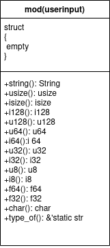

# userinput
userinput is a simple rust library for checking the error during userinput 
 
<h3>UML DIAGRAM</h3>

 
eg:
 
<pre>
fn main()
{
    println!("Enter the usize");
    let input = userinput::usize();
    println!("input:{} usize:{}",input,type_of(input));
}

output:
Enter the usize
25
input:25 datatype:usize

syntax : userinput::datatype() //usize,isize,f64,f32,i128,u128,i64,u64,i32,u32,i8,u8,char,string
       : userinput::type_of(variable_name)

sample:
let input = userinput::usize();
let input = userinput::string();
let input = userinput::char();

</pre>

